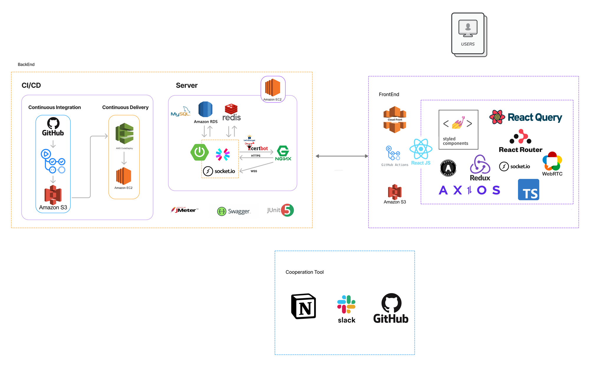
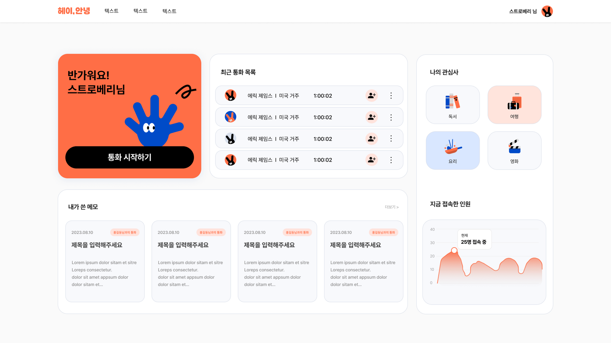
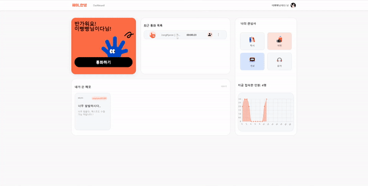
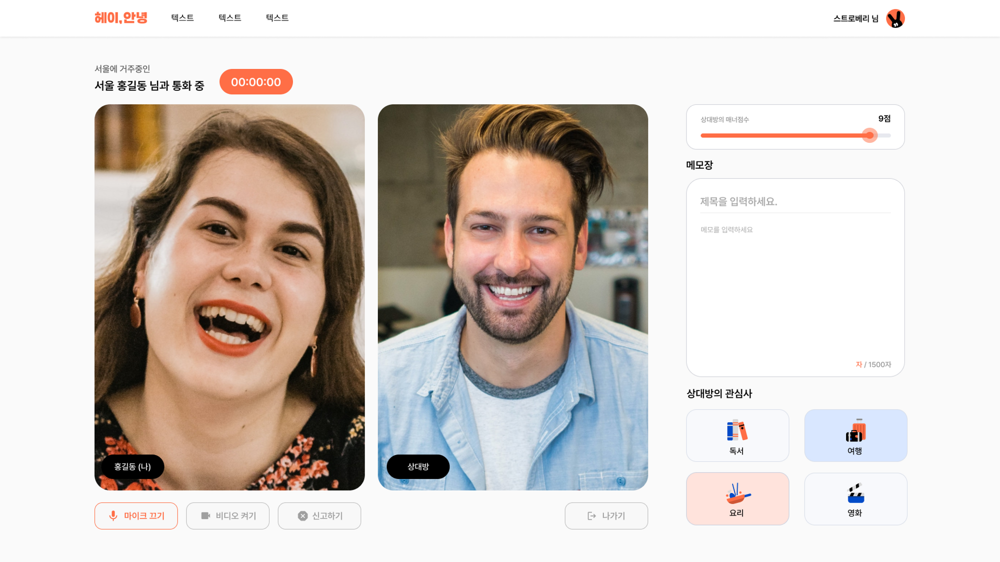
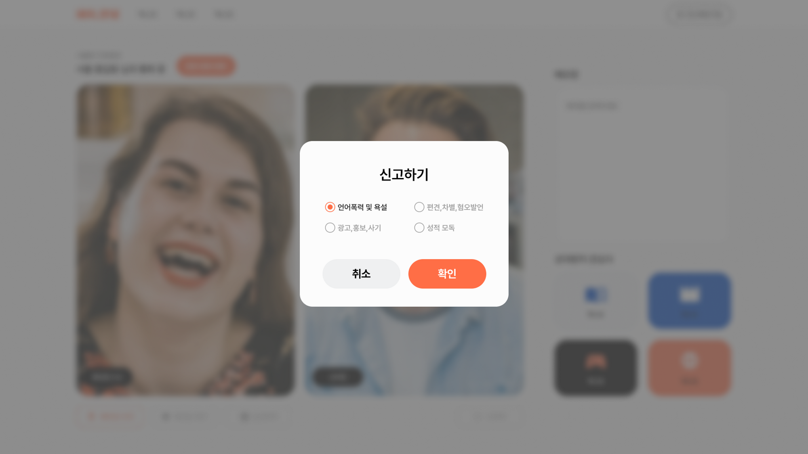
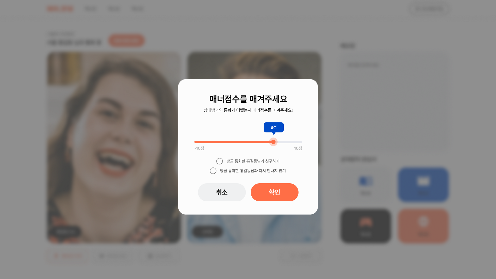
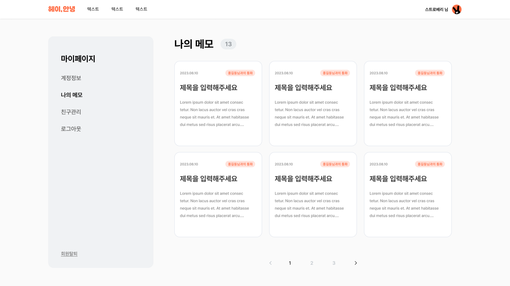
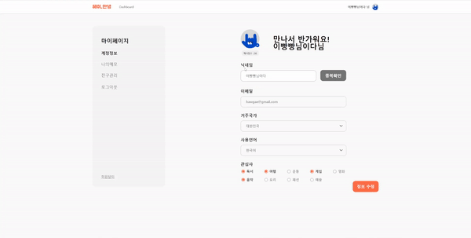
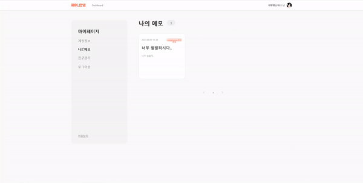

 

# 헤이, 안녕 🖐

요즘 핫한 외국어 공부, 다른 사람과 함께 하고 싶다면? 헤이 안녕을 사용해주세요. 헤이 안녕은 한영권 사람들이 1대 1 영상통화를 통해 서로의 언어를 나누는 언어교환 서비스 입니다.

## 프로젝트 팀원 🧏‍♀️🧏‍♂️

 

|            나혜림(FE) 부팀장            |                 김다솔(FE)                 |                이영우(FE)                 |             박현우(BE) 팀장             |                    안종현(BE)                     |                김신형(BE)                 |               안민현(BE)                | 김세영(DE) |
| :-------------------------------------: | :----------------------------------------: | :---------------------------------------: | :-------------------------------------: | :-----------------------------------------------: | :---------------------------------------: | :-------------------------------------: | :--------: |
| [HyerimNa](https://github.com/HyerimNa) | [SOL KIM](https://github.com/solightnsalt) | [2Zerozero](https://github.com/2Zerozero) | [hyun1024](https://github.com/hyun1024) | [jonghyeon1013](https://github.com/jonghyeon1013) | [userkim12](https://github.com/userkim12) | [giminion](https://github.com/giminion) |            |

## 서비스 아키텍쳐

### Front-End

           

### Back-End

         

### Cooperation Tool

  

 

## 주요 기능

유저의 사용기록을 전반적으로 확인할 수 있는 대시보드

다른 언어를 사용하는 랜덤한 유저와의 1:1 실시간 영상통화

클린한 사이트를 유지하지 위한 신고, 차단, 매너점수 제도

통화 시 작성한 메모를 확인 할 수 있는 나의 메모장

마이페이지에서 프로필, 작성한 메모도 수정이 가능해요

 
