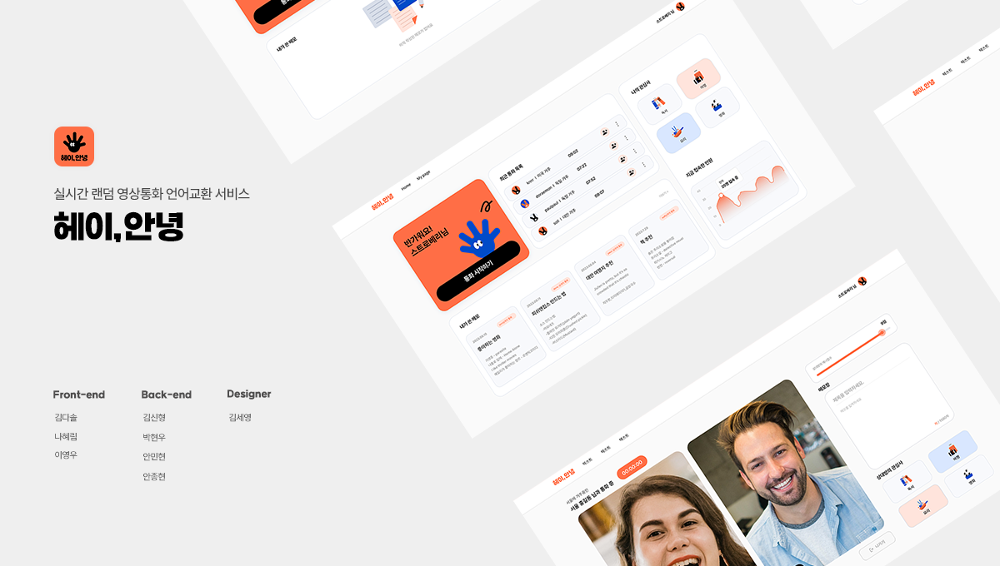

 
<h1>
헤이, 안녕
</h1>

<h2>프로젝트 팀원 🧏‍♀️🧏‍♂️</h2>
 

|               나혜림(FE)                |                 김다솔(FE)                 |                이영우(FE)                 |               박현우(BE)                |                    안종현(BE)                     |                김신형(BE)                 |               안민현(BE)                | 김세영(Designer) |
| :-------------------------------------: | :----------------------------------------: | :---------------------------------------: | :-------------------------------------: | :-----------------------------------------------: | :---------------------------------------: | :-------------------------------------: | :--------------: |
| [HyerimNa](https://github.com/HyerimNa) | [SOL KIM](https://github.com/solightnsalt) | [2Zerozero](https://github.com/2Zerozero) | [hyun1024](https://github.com/hyun1024) | [jonghyeon1013](https://github.com/jonghyeon1013) | [userkim12](https://github.com/userkim12) | [giminion](https://github.com/giminion) |                  |

<h2>서비스 아키텍쳐</h2>
 

<h2>주요 기능</h2>
 
<h3>유저의 사용기록을 전반적으로 확인할 수 있는 대시보드</h3>

<h3>다른 언어를 사용하는 랜덤한 유저와의 1:1 실시간 영상통화</h3>

<h3>클린한 사이트를 유지하지 위한 신고, 차단, 매너점수 제도</h3>

<h3>통화 시 작성한 메모를 확인 할 수 있는 나의 메모장</h3>

<h2>서비스 아키텍쳐</h2>
 
